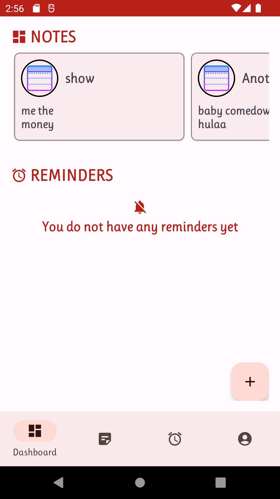

# Pin-It
Pin-It is an Android application built with the latest MAD skills by the Android team.
The application is a utility app that helps you keep up with your tasks and day to day activities.
The app is still in progress, you are about to delete any other utility app in your phone.

The application has included [Clean Architecture by Uncle Bob](https://www.oreilly.com/library/view/clean-architecture-a/9780134494272/) that guides in separation of concerns for easier testing and debugging.

## Tools
The application has been built using the following:

* The application has been built with the following:

    * [Kotlin](https://kotlinlang.org/)
    * [Coroutines](https://kotlinlang.org/docs/reference/coroutines-overview.html)
    * [Flow](https://kotlinlang.org/docs/reference/coroutines/flow.html)
    * [Jetpack](https://developer.android.com/jetpack)
        * [Lifecycle](https://developer.android.com/topic/libraries/architecture/lifecycle)
        * [ViewModel](https://developer.android.com/topic/libraries/architecture/viewmodel)
    * [Koin](https://insert-koin.io)

* Architecture
    * App Architecture - MVVM + Clean Architecture

* Tests
    * [JUnit5](https://junit.org/junit5/)

## Screenshots
Take a peek at what am working on

DASHBOARD SCREEN | NOTES SCREEN |
----------- | ----------- | 
 |  |

## LICENSE
This project is distributed under Apache License 2.0
